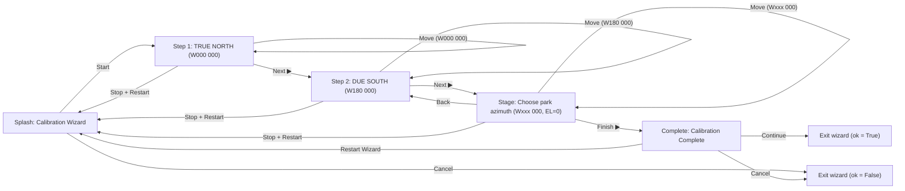
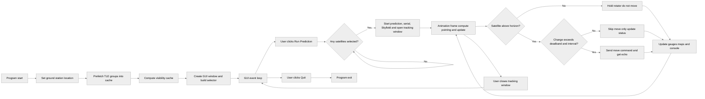

## AMSAT Ground Station Tracking Software
### A dual-band amateur satellite tracking system using:
- Skyfield for orbital propagation
- Tkinter for the GUI
- Basemap for global + near-sided maps
- Yaesu G-5500DC + GS-232B rotator interface
- Automatic TLE fetching and visibility prediction


###  Repository Structure

```
amsat/
├── archive/
├── assets/
├── src/
│ ├── tle/
│ │   ├── amateur.tle
│ │   ├── cubesat.tle
│ │   ├── goes.tle
│ │   ├── noaa.tle
│ │   ├── satnogs.tle
│ │   └── weather.tle
│ ├── gs232/
│ │   ├── __init__.py
│ │   ├── commands.py
│ │   └── serial_manager.py
│ ├── gui/
│ │   ├── __init__.py
│ │   ├── gauges.py
│ │   └── maps.py
│ ├── calibration_wizard.py
│ ├── constants.py
│ ├── coordinate_conversion.py
│ ├── fetch_tle.py
│ ├── keplerian_parser.py
│ ├── main_gs232b.py
│ ├── pass_visibility.py
│ ├── skyfield_predictor.py
│ └── test_pass_visibility.py
│
└── README.md
```

### Installation Steps
> **Note:** Run these commands from the repository root after cloning.

1. **Clone the Repository**
   ```bash
   git clone <repository_url>
   cd <repository_directory>

2. **Create and Activate Virtual Environment:**
   ```bash
   conda env create -f assets/amsat.yml
   conda activate amsat

3. **Run Tracking Software:**
   ```bash
   cd src
   python3 main_gs232b.py
> **Note:** The GUI will start in simulation mode if no GS-232B rotator is detected on a serial port.

---
## Antenna Boresight Wizard

A standalone Tkinter-based tool for aligning the Yaesu G-5500DC/GS-232B antenna rotator system before satellite tracking.
#### Note: Checks if hardware is present as well
### Usage

```bash
python3 calibration_wizard.py
```

---
### Overview


This tool performs a structured **boresight sequence** independent of the main tracking GUI:
1. **Point to True North:**
   Sends `W000 000` and allows the user to verify azimuth alignment.
2. **Point to Due South:**
   Sends `W180 000` and allows confirmation of travel range.
3git . **Stage / Park:**
   Lets the user select a fixed azimuth (0–345° in 15° steps) to park the array before exit.


---


### Software Flow Diagram




